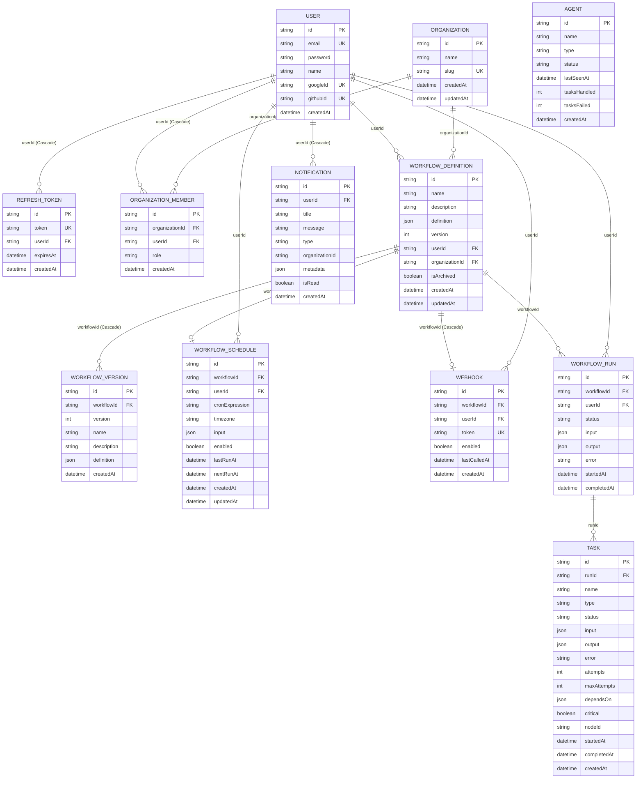

# Orqestr — Tech Stack Justification & Scaling Decisions

A comprehensive, production-grade guide detailing why each technology was selected for **Orqestr**, which alternatives were evaluated and rejected, how each choice behaves under hyperscale (10,000+ concurrent workflows), and in-depth interview questions with defensible engineering answers.

---

## Table of Contents

1. [Architectural Overview & Philosophy](#1-architectural-overview--philosophy)
2. [Deep Technology Breakdown & Alternative Analysis](#2-deep-technology-breakdown--alternative-analysis)
   - [2.1 Distributed Task Queue: BullMQ on Redis](#21-distributed-task-queue-bullmq-on-redis)
   - [2.2 Database & ORM: PostgreSQL + Prisma](#22-database--orm-postgresql--prisma)
   - [2.3 Backend Framework: Express.js with TypeScript](#23-backend-framework-expressjs-with-typescript)
   - [2.4 Real-Time Streaming: Server-Sent Events (SSE)](#24-real-time-streaming-server-sent-events-sse)
   - [2.5 AI & LLM Inference: Groq Cloud API](#25-ai--llm-inference-groq-cloud-api)
   - [2.6 Frontend Architecture: Next.js 16 (App Router) + React 19](#26-frontend-architecture-nextjs-16-app-router--react-19)
   - [2.7 Visual DAG Builder: React Flow (@xyflow/react)](#27-visual-dag-builder-react-flow-xyflowreact)
   - [2.8 Graph Auto-Layout Engine: Dagre (dagre)](#28-graph-auto-layout-engine-dagre-dagre)
   - [2.9 Server State & Cache: TanStack React Query v5 + Devtools](#29-server-state--cache-tanstack-react-query-v5--devtools)
   - [2.10 Authentication Architecture: Custom Dual-Token JWT + Storage Sync + Ephemeral OAuth](#210-authentication-architecture-custom-dual-token-jwt--storage-sync--ephemeral-oauth)
   - [2.11 Monorepo & Tooling: pnpm Workspaces](#211-monorepo--tooling-pnpm-workspaces)
   - [2.12 Testing Framework: Vitest](#212-testing-framework-vitest)
   - [2.13 Structured Logging & Production Redaction Engine: Winston + Custom Sanitizer](#213-structured-logging--production-redaction-engine-winston--custom-sanitizer)
3. [Core Architectural Paradigm Choices](#3-core-architectural-paradigm-choices)
4. [Deep Engineering Tradeoffs Matrix](#4-deep-engineering-tradeoffs-matrix)
5. [Scaling Evolution Matrix (100 → 10,000 → 100,000 Concurrency)](#5-scaling-evolution-matrix-100--10000--100000-concurrency)
6. [Tough Interview Questions & Answers](#6-tough-interview-questions--answers)

---

## 1. Architectural Overview & Philosophy

Orqestr is designed around four core principles:
1. **Asynchronous Decoupling**: The API server receiving workflow triggers never executes heavy tasks (HTTP calls, LLM inference, data parsing) in the request-response cycle.
2. **Explicit Dependency Graphs**: Workflows are compiled into directed acyclic graph (DAG) adjacency maps, enabling automatic parallelization (fan-out) and synchronization (fan-in).
3. **Resilient Failure Boundaries**: Critical tasks fail the entire pipeline; non-critical tasks pipe structured error payloads downstream so execution continues.
4. **Zero-Data-Loss User Experience**: Client-side graph draft persistence and silent token refreshing ensure network hiccups or session expirations never wipe out visual workflow compositions.

---

## 2. Deep Technology Breakdown & Alternative Analysis

---

### 2.1 Distributed Task Queue: BullMQ on Redis

#### Why BullMQ on Redis?
* **Purpose-Built Task Semantics**: BullMQ is specifically engineered for job queues requiring exponential backoff retries, delayed scheduling, job locking, atomic state transitions, and parent-child dependencies.
* **In-Memory Low Latency**: Operating on Redis gives microsecond-level enqueue/dequeue latency compared to disk-backed message brokers.
* **Distributed Concurrency & Locks**: BullMQ uses Redis atomic Lua scripts (`SET NX PX`) to lock jobs per worker. If a worker crashes mid-task, the lock TTL expires, and the job is automatically reassigned to a healthy worker.
* **Built-in Repeatable Crons**: Manages distributed recurring cron schedules natively via Redis sorted sets (`ZSET`), eliminating the need for external cron daemon services.

#### Alternatives Evaluated & Rejected:

| Alternative | Why Considered | Why Rejected for Orqestr |
| :--- | :--- | :--- |
| **Apache Kafka** | Extreme throughput, event streaming, immutable log | Kafka is an **event streaming log**, not a **task queue**. It lacks native per-message retry with backoff, dead-letter re-queueing, dynamic delayed execution, and fine-grained job locking. Overkill operational overhead (ZooKeeper/KRaft, partition rebalancing). |
| **RabbitMQ (AMQP)** | Traditional enterprise message broker, flexible routing | Good message broker, but Node.js client (`amqplib`) lacks built-in job state management (progress tracking, failed sets, automatic retries with exponential backoff). Requires manual dead-letter exchange (DLX) wiring and separate storage for job metadata. |
| **Temporal / Cadence** | Complete code-as-configuration durable execution engine | Excellent for multi-day durable timers and compensation workflows, but introduces massive infrastructure complexity (Temporal cluster, Cassandra/PostgreSQL persistence, custom worker SDKs) that obscures the core architectural mechanics. |
| **AWS SQS + EventBridge** | Fully managed cloud serverless messaging | Cloud vendor lock-in; poor local development experience requiring localstack or internet connectivity; higher latency (50-100ms vs <5ms for Redis); strict message size caps (256 KB). |
| **Celery (Python)** | Industry standard Python task queue | Requires Python runtime; splits backend codebase across two languages when the orchestrator is written in TypeScript. |

#### How It Scales at 10,000+ Concurrent Runs:
* Migrate from standalone Redis to **Redis Cluster** (e.g. 3 masters, 3 replicas) or **AWS ElastiCache Redis**. BullMQ natively supports Redis Cluster by partitioning queue keys across hash slots (`{queueName}`).
* Apply BullMQ rate limiters (`limiter: { max: 100, duration: 60000 }`) per queue to prevent API rate limit exhaustion on external providers like Groq.

---

### 2.2 Database & ORM: PostgreSQL + Prisma

#### Why PostgreSQL + Prisma?
* **Relational Integrity with JSON Flexibility**: Workflows, runs, users, memberships, and tasks have strict relational dependencies (foreign keys, cascading deletes). However, node definitions, task inputs, and task outputs have dynamic, heterogeneous schemas. PostgreSQL's native `JSONB` data type provides the flexibility of a document store with the transactional guarantees (`ACID`) of a relational database.
* **Prisma Type Safety**: Prisma auto-generates TypeScript types directly from `schema.prisma`. Any database schema change results in immediate compile-time type errors across controllers, services, and tests.
* **Compound Unique Constraints**: Used extensively (e.g., `@@unique([name, type])` on `Agent`, `@@unique([organizationId, userId])` on `OrganizationMember`, `@@unique([workflowId, version])` on `WorkflowVersion`) to enforce business invariants at the database engine level.

#### Detailed Database Schema & Entity Relationships

The PostgreSQL database is organized into 11 core tables managed via Prisma (`schema.prisma`):

##### Entity Details, Keys & Constraints:

1. **`User` (`users`)**:
   - **PK**: `id` (`cuid()`)
   - **Unique Constraints**: `email` (UK), `googleId` (UK, nullable), `githubId` (UK, nullable).
   - **Nullable Fields**: `password` (nullable for OAuth-only users), `googleId`, `githubId`.
   - **Relationships**: 1-to-many with `WorkflowDefinition`, `WorkflowRun`, `RefreshToken`, `WorkflowSchedule`, `Webhook`, `OrganizationMember`.

2. **`RefreshToken` (`refresh_tokens`)**:
   - **PK**: `id` (`cuid()`)
   - **FK**: `userId` $\rightarrow$ `User.id` with `onDelete: Cascade`.
   - **Unique Constraints**: `token` (UK).

3. **`Organization` (`organizations`)**:
   - **PK**: `id` (`cuid()`)
   - **Unique Constraints**: `slug` (UK).
   - **Relationships**: 1-to-many with `OrganizationMember`, 1-to-many with `WorkflowDefinition`.

4. **`OrganizationMember` (`organization_members`)**:
   - **PK**: `id` (`cuid()`)
   - **FKs**: `organizationId` $\rightarrow$ `Organization.id` (Cascade), `userId` $\rightarrow$ `User.id` (Cascade).
   - **Compound Unique Constraint**: `@@unique([organizationId, userId])` (enforces single membership role per workspace).
   - **Enum**: `role: OrgRole (OWNER | ADMIN | MEMBER)` (default: `MEMBER`).

5. **`WorkflowDefinition` (`workflow_definitions`)**:
   - **PK**: `id` (`cuid()`)
   - **FKs**: `userId` $\rightarrow$ `User.id` (nullable), `organizationId` $\rightarrow$ `Organization.id` (nullable).
   - **Flags**: `isArchived` (`Boolean`, default `false`, soft delete flag).
   - **Data**: `definition` (`JSONB`, stores visual graph DAG).
   - **Indexes**: `@@index([userId])`, `@@index([organizationId])`, `@@index([isArchived])`.
   - **Relationships**: 1-to-many with `WorkflowRun`, `WorkflowVersion`, 1-to-1 with `WorkflowSchedule`, `Webhook`.

6. **`WorkflowVersion` (`workflow_versions`)**:
   - **PK**: `id` (`cuid()`)
   - **FK**: `workflowId` $\rightarrow$ `WorkflowDefinition.id` (Cascade).
   - **Compound Unique Constraint**: `@@unique([workflowId, version])`.

7. **`WorkflowSchedule` (`workflow_schedules`)**:
   - **PK**: `id` (`cuid()`)
   - **FK**: `workflowId` $\rightarrow$ `WorkflowDefinition.id` (Cascade, Unique 1-to-1), `userId` $\rightarrow$ `User.id`.
   - **Unique Constraint**: `workflowId` (UK, 1 schedule per workflow).

8. **`Webhook` (`webhooks`)**:
   - **PK**: `id` (`cuid()`)
   - **FK**: `workflowId` $\rightarrow$ `WorkflowDefinition.id` (Cascade, Unique 1-to-1), `userId` $\rightarrow$ `User.id`.
   - **Unique Constraints**: `workflowId` (UK), `token` (UK, 48-char secret).

9. **`WorkflowRun` (`workflow_runs`)**:
   - **PK**: `id` (`cuid()`)
   - **FK**: `workflowId` $\rightarrow$ `WorkflowDefinition.id`, `userId` $\rightarrow$ `User.id` (nullable).
   - **Enum**: `status: RunStatus (PENDING | RUNNING | COMPLETED | FAILED | CANCELLED)`.
   - **Relationships**: 1-to-many with `Task`.

10. **`Task` (`tasks`)**:
    - **PK**: `id` (`cuid()`)
    - **FK**: `runId` $\rightarrow$ `WorkflowRun.id`.
    - **Enums**: `type: AgentType (LLM_AGENT | HTTP_AGENT | TRANSFORM_AGENT | ...)`, `status: TaskStatus (PENDING | RUNNING | COMPLETED | FAILED | CANCELLED)`.
    - **DAG Adjacency**: `dependsOn: JSON` (array of parent `Task.id` strings).

11. **`Agent` (`agents`)**:
    - **PK**: `id` (`cuid()`)
    - **Compound Unique Constraint**: `@@unique([name, type])` (worker process singleton).

12. **`Notification` (`notifications`)**:
    - **PK**: `id` (`cuid()`)
    - **FK**: `userId` $\rightarrow$ `User.id` (Cascade).
    - **Fields**: `title`, `message`, `type`, `organizationId` (nullable), `metadata` (JSONB), `isRead` (Boolean, default `false`).
    - **Indexes**: `@@index([userId, isRead])`, `@@index([userId, createdAt])`.

---

#### Alternatives Evaluated & Rejected:

| Alternative | Why Considered | Why Rejected for Orqestr |
| :--- | :--- | :--- |
| **MongoDB (Document DB)** | Flexible schema matches JSON workflow graphs | Weak cross-collection relational constraints and transactions. Ensuring an agent count increments atomically while a task marks completed across collections is more complex. Postgres handles JSON columns just as well. |
| **Drizzle ORM** | SQL-like query syntax, zero-overhead client, faster cold starts | Drizzle is excellent, but Prisma's declarative migration engine (`prisma db push`, `prisma migrate`) and rich ecosystem made solo full-stack iteration significantly faster and safer. |
| **TypeORM / Sequelize** | Older, established TypeScript ORMs | Outdated decorator syntax, clumsy migration workflows, poor type inference compared to Prisma's generated client. |
| **Raw SQL (`pg` / `knex`)** | Maximum performance, fine-grained query control | High boilerplate; manual mapping of SQL rows to TypeScript interfaces introduces runtime type divergence and security risks (SQL injection if queries aren't parameterized carefully). |

#### How It Scales at 10,000+ Concurrent Runs:
* Introduce **PgBouncer** connection pooling in transaction mode to multiplex thousands of worker connections into a pool of ~50-100 database connections.
* Implement **Read Replicas** via PostgreSQL streaming replication: write queries (task status updates, run creations) route to Primary; read queries (dashboard metrics, workflow list views) route to Read Replicas.

---

### 2.3 Backend Framework: Express.js with TypeScript

#### Why Express.js with TypeScript?
* **Predictable, Battle-Tested Middleware Pipeline**: Express is straightforward, universally understood, and has zero framework magic. Every request travels through explicit, testable middleware layers (`cors`, `cookieParser`, `requestLogger`, `authenticate`, `orgMiddleware`, `errorHandlerMiddleware`).
* **Clean Layered Architecture (Controller / Service / Repository)**: Enforced strict separation of concerns manually without needing heavyweight framework abstractions. Business logic in services is 100% decoupled from Express HTTP objects (`req`, `res`).
* **Non-Blocking Async Event Loop**: Well suited for I/O-bound orchestration where threads spend 99% of their time waiting on Redis queues, PostgreSQL queries, and LLM HTTP responses.

#### Alternatives Evaluated & Rejected:

| Alternative | Why Considered | Why Rejected for Orqestr |
| :--- | :--- | :--- |
| **NestJS** | Enterprise structure, built-in dependency injection | Heavy boilerplate (decorators, modules, providers, DTO classes, metadata reflection). Adds unnecessary cognitive overhead and slower iteration speed for a dedicated orchestrator without delivering features that custom layered TypeScript cannot achieve. |
| **Fastify** | 2-3x higher raw HTTP throughput, schema validation | High throughput is impressive in benchmarks, but the system bottleneck in Orqestr is external LLM latency (200-800ms) and database I/O, not HTTP routing overhead (which is <1ms in Express). Express's ecosystem and middleware compatibility won out. |
| **Go (Gin / Fiber)** | Native concurrency (Goroutines), compiled binary, ultra-low memory | Go is fantastic for microservices, but sharing TypeScript types across `client/` and `server/` inside a monorepo eliminates an entire class of schema drift bugs. |
| **Python (FastAPI)** | Native AI/ML ecosystem, Pydantic validation | Python's Global Interpreter Lock (GIL) and async loop (`asyncio`) can be tricky under high concurrency compared to Node's V8 engine. Node.js has superior library ergonomics for BullMQ and React Flow integration. |

---

### 2.4 Real-Time Streaming: Server-Sent Events (SSE)

#### Why Server-Sent Events (SSE)?
* **Unidirectional Nature of Run Monitoring**: During workflow execution, data flows strictly **from server to browser** (task dispatched, task running, task completed, run finished). The browser never needs to send messages upstream over the monitoring socket.
* **Native Browser Support (Zero Extra Libraries)**: Uses the browser's standard `EventSource` API. Built-in automatic reconnection, event IDs, and CORS support.
* **HTTP/2 Friendly**: Operates over standard HTTP/HTTPS ports (80/443), avoiding firewall and proxy WebSocket termination issues.
* **Lower Overhead than WebSockets**: Avoids the WebSocket protocol upgrade handshake, TCP keep-alive pings, and stateful socket framing overhead.

#### Alternatives Evaluated & Rejected:

| Alternative | Why Considered | Why Rejected for Orqestr |
| :--- | :--- | :--- |
| **WebSockets (Socket.io / ws)** | Bidirectional real-time communication | Overkill for unidirectional status updates. Requires stateful connection management, custom heartbeat handlers, and heavier client libraries. |
| **Short / Long Polling** | Simple HTTP endpoints, zero persistent connections | Destroys database performance under load: 1,000 users polling every 2 seconds = 500 requests/sec hammering the database with `SELECT * FROM tasks WHERE runId = ...`. |
| **gRPC-Web** | Binary protocol buffers, high efficiency | Requires an Envoy proxy intermediary to translate HTTP/2 gRPC framing for browser clients; complex build tooling for frontend types. |

#### How It Scales at 10,000+ Concurrent Runs:
* In a single server, `RunEmitter` is a Node.js in-memory `EventEmitter`. When scaled to multiple API servers behind a load balancer, replace `RunEmitter` with **Redis Pub/Sub**: the orchestrator publishes to `run:${runId}`, and all API server instances subscribe and push to their local SSE client sockets.

---

### 2.5 AI & LLM Inference: Groq Cloud API

#### Why Groq Cloud API (`openai/gpt-oss-120b`, `openai/gpt-oss-20b`)?
* **LPUs (Language Processing Units) with Unrivaled Inference Speed**: Groq's custom silicon delivers 300–500 tokens/second. In multi-step pipelines where tasks run sequentially (`HTTP -> LLM -> Transform`), low LLM latency is critical to prevent pipeline timeouts.
* **OpenAI-Compatible REST API**: Standardized request/response formats (`chat/completions`) allow switching base URLs to OpenAI, Anthropic, or local vLLM instances without modifying agent worker logic.
* **Open-Source Model Choice**: Supports state-of-the-art open weights (`openai/gpt-oss-120b`, `qwen/qwen3.6-27b`) that provide high reasoning capability without vendor lock-in.

#### Alternatives Evaluated & Rejected:

| Alternative | Why Considered | Why Rejected for Orqestr |
| :--- | :--- | :--- |
| **OpenAI (GPT-4o / GPT-4o-mini)** | Benchmark gold standard for intelligence | Significantly slower time-to-first-token (TTFT) and throughput compared to Groq's LPUs; higher cost per token for high-volume batch workflow execution. |
| **Local Ollama / vLLM** | Zero API cost, complete privacy | Requires dedicated high-end GPU infrastructure (NVIDIA A100/H100 or RTX 4090s) which makes local development and lightweight cloud deployment expensive and inaccessible. |
| **Anthropic Claude API** | Superior reasoning and XML parsing | Higher latency and non-standard API structure compared to standard OpenAI-compatible formats. |

---

### 2.6 Frontend Architecture: Next.js 16 (App Router) + React 19

#### Why Next.js 16 (App Router) + React 19?
* **Route Groups for Context Separation**: Uses `(auth)` for login/register screens, `(builder)` for full-bleed workflow canvas layouts (hiding root navbars), and `(dashboard)` for standard analytics.
* **Turbopack Build Performance**: Sub-second Hot Module Replacement (HMR) during rapid UI iteration on complex canvas nodes.
* **Production-Grade SSR & Hybrid Optimization**: Initial page shells render with SEO and security headers; interactive canvases hydrate smoothly on the client.

#### Alternatives Evaluated & Rejected:

| Alternative | Why Considered | Why Rejected for Orqestr |
| :--- | :--- | :--- |
| **Vite + React SPA** | Simple, fast client-only build tooling | Lacks built-in file-based routing, nested layouts, and server component optimizations; requires stitching together multiple third-party packages for routing and head management. |
| **Remix / React Router v7** | Strong web standards and nested loader pattern | App Router's ecosystem, Vercel zero-config deployment, and Turbopack support provided a smoother developer workflow. |

---

### 2.7 Visual DAG Builder: React Flow (`@xyflow/react`)

#### Why React Flow?
* **Production Standard for Graph Canvas UI**: Native support for custom node types, interactive bezier edge routing, drag-and-drop palettes, mini-maps, pan/zoom controls, and keyboard navigation.
* **Headless React Integration**: Nodes are just React components. Allows embedding rich custom UI (dropdowns, inputs, status badges, expandable guide cards) directly inside graph nodes without canvas re-rendering bugs.
* **Clean State Export**: Serializes the canvas directly into a clean JSON structure: `{ nodes: [...], edges: [...] }` that maps 1-to-1 with backend workflow definitions.

#### Alternatives Evaluated & Rejected:

| Alternative | Why Considered | Why Rejected for Orqestr |
| :--- | :--- | :--- |
| **HTML5 Canvas / Konva.js** | Raw pixel rendering, high performance for 10,000 nodes | Imperative canvas drawing makes embedding interactive HTML form controls (inputs, dropdowns, buttons) inside nodes extraordinarily painful and unmaintainable. |
| **Cytoscape.js / D3.js** | Powerful graph algorithms and scientific visualizations | Designed for data visualization, not visual editing. Building drag-and-drop node creation, port snapping, and editable forms on top of D3 requires building an entire visual editor from scratch. |
| **GoJS** | Feature-complete enterprise diagramming | Heavy commercial licensing costs ($3,000+ per developer), non-React imperative API. |

---

### 2.8 Graph Auto-Layout Engine: Dagre (`dagre`)

#### Why Dagre?
* **Deterministic Hierarchical DAG Layout**: Implements the Sugiyama algorithm for layered graph drawing. Automatically arranges complex multi-branch graphs with minimal edge crossings and balanced rank separation.
* **Bi-directional Flow Flexibility**: Supports both Left-to-Right (`LR`) and Top-to-Bottom (`TB`) orientations with customizable node separation (`nodesep: 80`) and rank separation (`ranksep: 100`).
* **Zero-Runtime Dependency**: Executes completely in the browser inside `client/lib/dagre-layout.ts`, computing $X, Y$ coordinates in < 15ms without server round-trips.

#### Alternatives Evaluated & Rejected:

| Alternative | Why Considered | Why Rejected for Orqestr |
| :--- | :--- | :--- |
| **ELK (Eclipse Layout Kernel)** | Highly advanced layout algorithms (ports, orthogonal routing) | Massive bundle size (> 1.2 MB); asynchronous web-worker required; overkill complexity for standard 5-20 node agent DAGs. |
| **D3-Hierarchy / D3-Force** | Physics-based force-directed simulation | Non-deterministic; nodes constantly wiggle and float instead of snapping into structured, readable pipeline columns. |
| **Manual Grid Math** | Zero dependencies, simple linear column offsets | Cannot handle arbitrary multi-parent converging fan-in branches without edges overlapping and obscuring nodes. |

---

### 2.9 Server State & Cache: TanStack React Query v5 + Devtools

#### Why TanStack Query?
* **Declarative Server State Synchronization**: Eliminates manual `useEffect` fetching, `isLoading` booleans, and error state tracking across components.
* **Smart Cache Invalidation**: When a user saves a workflow, `queryClient.invalidateQueries({ queryKey: ["workflows"] })` automatically refetches data across every active dashboard view.
* **Background Polling & Window Focus Refetching**: Keeps agent online status and dashboard statistics up-to-date automatically with configurable `staleTime` and `refetchInterval`.
* **React Query Devtools**: Provides instant visual inspection of query keys, cache status (`stale`, `fresh`, `fetching`), and garbage collection during development.

#### Alternatives Evaluated & Rejected:

| Alternative | Why Considered | Why Rejected for Orqestr |
| :--- | :--- | :--- |
| **Redux Toolkit (RTK) / Zustand** | Global client-side state management | Server data is **cached remote state**, not client state. Using Redux for server data requires hundreds of lines of boilerplate reducers, loading actions, and cache normalization logic that TanStack Query handles in one hook (`useQuery`). |
| **SWR (Vercel)** | Lightweight data fetching hook | SWR is good, but TanStack Query v5 has vastly superior mutation handling (`useMutation`), query invalidation control, and devtools. |

---

### 2.10 Authentication Architecture: Custom Dual-Token JWT + Storage Sync + Ephemeral OAuth

#### Why Custom Dual-Token JWT & Ephemeral OAuth?
* **Zero External Auth Vendor Lock-In**: Full control over token lifecycles, claims, database sessions, and multi-tenant organization scoping without monthly active user (MAU) pricing tiers.
* **Dual-Layer Resilience**: 15-minute access token (stored in memory/localStorage) + 7-day refresh token (stored in `httpOnly` cookie and body fallback) with database-level revocation on logout.
* **Cryptographic OAuth CSRF State & One-Time Code Exchange**: Google and GitHub OAuth redirects generate a 32-byte cryptographic state saved in Redis (300s TTL) to eliminate CSRF vulnerabilities. Upon successful provider authentication, the backend issues an ephemeral 32-byte exchange code (60s TTL) consumed via rate-limited `POST /api/auth/oauth/exchange`. Tokens are never exposed in URLs, browser history, or referer headers.
* **Cross-Tab Synchronization**: Listens to browser `window.storage` events. When a user logs in or out in Tab A, Tabs B and C instantly synchronize without reloading.
* **In-Context Auth Dialog**: Unauthenticated users can design workflows freely. Clicking "Save" stores the canvas draft locally and displays an in-place auth modal, preventing disruptive route redirects.

#### Alternatives Evaluated & Rejected:

| Alternative | Why Considered | Why Rejected for Orqestr |
| :--- | :--- | :--- |
| **Clerk / Auth0** | Turnkey authentication UI and hosted sessions | Expensive MAU pricing; vendor lock-in; redirects away from the application canvas, making seamless draft preservation harder to coordinate. |
| **NextAuth.js (Auth.js)** | Popular Next.js auth library | Tightly coupled to Next.js server runtime; makes sharing authentication state with an independent Express API server cumbersome. |
| **Supabase / Firebase Auth** | Built-in authentication with database | Couples authentication to a specific backend-as-a-service vendor rather than keeping the Express backend standalone and portable. |

---

### 2.11 Monorepo & Tooling: pnpm Workspaces

#### Why pnpm Workspaces?
* **Content-Addressable Storage**: Packages are stored once globally on disk and hard-linked into projects, saving gigabytes of disk space and accelerating CI/CD build times.
* **Strict Dependency Isolation**: Prevents phantom dependencies (importing packages that aren't explicitly declared in `package.json`).
* **Clean Monorepo Orchestration**: Single command (`pnpm dev`) starts both `client/` and `server/` with unified linting and formatting.

---

### 2.12 Testing Framework: Vitest

#### Why Vitest?
* **Vite-Powered Speed & ESM Native**: 5–10x faster execution than Jest because it runs directly on modern ES modules without transpilation layers (`ts-jest` / `babel-jest`).
* **Jest-Compatible API**: Drop-in replacement for `describe`, `it`, `expect`, `vi.fn()`, and `vi.spyOn()`.
* **373 Passing Unit & Integration Tests (44 Test Suites)**: Comprehensive test suite comprising 262 server tests and 111 client tests covering orchestrator dependency resolution, concurrency race guards, agent workers, template parsing, RBAC boundaries, and scheduler cleanup.

---

### 2.13 Structured Logging & Production Redaction Engine: Winston + Custom Sanitizer

#### Why Winston with Centralized Redaction?
* **Deep Multi-Layer Redaction**: Uses a dedicated sanitizer ([`log-sanitizer.ts`](file:///c:/Users/nikhil/Desktop/projectss/ai-orchestor/Orqestr/server/utils/log-sanitizer.ts)) that masks PostgreSQL/MySQL/MongoDB passwords, Redis credentials, Bearer tokens, standalone JWTs, and third-party API keys (`gsk_***`, `gh_***`) across console and file transports.
* **Request Correlation (`x-request-id`)**: Generates or forwards an `x-request-id` UUID on every inbound request, printing `[req:<id>]` across all logs.
* **Zero-Leakage 500 Diagnostics**: Internal 500 exceptions print full sanitized stack traces to server logs while returning generic error codes and the `requestId` to clients, facilitating cross-referencing without leaking internal implementation details.

---

## 3. Core Architectural Paradigm Choices

In technical and system design interviews, explaining **why** the high-level architecture is structured this way is just as critical as justifying individual library choices:

### 3.1 Why Asynchronous Decoupled Execution instead of a Synchronous Monolith?
* **The Synchronous Failure Trap**: A multi-step workflow chaining external LLMs, HTTP fetches, and data transformations takes between 5 and 60 seconds. Running this synchronously in an Express request handler holds open HTTP connection sockets, monopolizes server worker threads, and crashes when gateways (Cloudflare 100s, AWS ALB 60s, Nginx 30s) drop the connection on timeout.
* **The Asynchronous Guarantee**: Orqestr decouples ingestion from execution. The API ingests the trigger request, writes a `WorkflowRun` row, and returns `200 OK` in < 50ms with a `runId`. Execution happens asynchronously in queue workers, streaming incremental updates over SSE. If an individual worker crashes or times out, the API server remains completely unaffected.

### 3.2 Why Separate the Orchestrator from the Agent Workers?
* **Decoupling Graph Logic from Worker Execution**: The Orchestrator understands graph topology (which nodes depend on which, which branches run in parallel, when the run finishes). The Agent Workers understand execution logic (how to call Groq, how to validate an HTTP URL, how to parse JSON).
* **Independent Scalability & Failure Isolation**: If an LLM worker hits a Groq rate limit or crashes with an unhandled exception, it does not crash the orchestrator. Furthermore, fast I/O workers (HTTP agent) can scale to 50 concurrent tasks without being constrained by the concurrency limits of slow LLM workers.

### 3.3 Why Redis & BullMQ Queues instead of In-Memory Background Promises?
* **Persistence Across Crashes**: If an Express server running in-memory promises (`setTimeout` / unawaited `async`) restarts or crashes, all in-flight workflow executions silently disappear without trace, recovery, or notification.
* **Distributed Locks & Automatic Reassignment**: BullMQ maintains job locks in Redis with automatic TTL renewals. If a worker dies, the lock expires and BullMQ safely returns the job to the queue for another worker to claim, guaranteeing at-least-once execution.

### 3.4 Why PostgreSQL with JSONB instead of MongoDB?
* **Strict Relational Integrity for Domain Entities**: Workspaces, users, role memberships, workflows, version snapshots, runs, tasks, and webhooks have strict foreign key relationships and cascading deletion semantics that MongoDB cannot enforce natively.
* **Best of Both Worlds**: PostgreSQL `JSONB` allows dynamic, schema-less storage for arbitrary visual graph layouts and heterogeneous node outputs, while preserving ACID transactions and relational foreign key constraints for the core system of record.

### 3.5 Why Custom Dual-Token JWT Authentication instead of Clerk or NextAuth?
* **Zero Vendor Lock-In & Portability**: Managed auth providers charge steep monthly active user (MAU) fees and tightly couple session tokens to their proprietary clouds.
* **Seamless In-Context Draft UX**: Unauthenticated users can design workflows on the canvas. When they click Save, an in-place auth modal appears over the canvas. Once authenticated, the canvas state is saved automatically without disruptive page redirects to third-party login screens.

---

## 4. Deep Engineering Tradeoffs Matrix

| Architectural Dilemma | Chosen Decision | Evaluated Alternative | Tradeoff Rationale |
| :--- | :--- | :--- | :--- |
| **Simplicity vs. Scalability** | **In-Process Workers & Single Express Server** (with clear modular boundaries) | Microservice fleet with independent Docker containers per agent | In-process execution enables instant local setup with `pnpm dev`, zero network hop latency between API and orchestrator, and shared TypeScript types. It trades away independent process autoscaling, which can be cleanly extracted when traffic requires it. |
| **Queue Semantics** | **BullMQ on Redis** | Apache Kafka | BullMQ provides job-level locks, exponential backoff retries, delayed cron scheduling, and dead-letter sets out of the box. Kafka is an event streaming log lacking native per-message retries without blocking partition heads. |
| **Real-Time Protocol** | **Server-Sent Events (SSE)** | WebSockets | Workflow execution monitoring is strictly unidirectional (server $\rightarrow$ client). SSE operates over standard HTTP, works with corporate proxies without WebSocket upgrade handshakes, and natively reconnects. |
| **Database Storage** | **PostgreSQL (`JSONB`)** | MongoDB / DynamoDB | Relational foreign key integrity for users, orgs, runs, and tasks; ACID transactions for version restores and cancellations; schema flexibility for canvas JSON graphs via `JSONB`. |
| **Workflow Versioning** | **Immutable Snapshots** | Git-style Diff / Delta Trees | Snapshotting enables $O(1)$ instant version retrieval without replaying diff chains, eliminating the risk of corrupted version history. Storage overhead is negligible for JSON graphs (< 50 KB). |
| **Scheduling** | **BullMQ Repeatables** | `node-cron` daemon | In-process `node-cron` fires duplicate triggers if multiple backend replicas are running. BullMQ repeatables use Redis atomic locks to guarantee singleton execution across server instances. |
| **Consistency vs. Latency** | **Atomic PostgreSQL Task Claiming** | Optimistic in-memory tracking | In converging DAG branches (fan-in), executing an atomic conditional SQL update (`updateMany`) before pushing to BullMQ adds ~2ms latency but completely eliminates duplicate task executions. |
| **Orchestrator Topology** | **Application-Level DAG Compiler** | Temporal Durable Execution Engine | Building a custom orchestrator gave us direct control over the DAG compiler, prompt interpolation engine, in-context node sandbox, and lightweight single-binary deployment without running a multi-node Temporal cluster. |

---

## 5. Scaling Evolution Matrix (100 → 10,000 → 100,000 Concurrency)

| Component | 100 Concurrent Runs (Current) | 10,000 Concurrent Runs (Scaled) | 100,000 Concurrent Runs (Enterprise) |
| :--- | :--- | :--- | :--- |
| **API Tier** | 1 Express process | 5–10 stateless Express instances behind AWS ALB | Kubernetes pods (HPA based on CPU/Request count) |
| **Orchestrator** | In-process module | Dedicated Orchestrator service + Redis locks | Partitioned orchestrator workers with consistent hashing by `workflowId` |
| **Agent Workers** | In-process with API server | Separate auto-scaling worker pools per agent type (`LLM`, `HTTP`, `Transform`) | Multi-region worker clusters; spot instances for batch jobs |
| **Job Queue** | Standalone Redis instance | Redis Cluster (3 shards + 3 replicas) | Redis Cluster with dedicated queues + Kafka for historical event auditing |
| **Database** | Single Neon / PostgreSQL DB | Primary DB + 2 Read Replicas + PgBouncer | Sharded PostgreSQL by `organizationId` + TimescaleDB for task execution logs |
| **Real-time SSE** | In-memory `RunEmitter` | Redis Pub/Sub broadcast across API instances | Centrifugo / AWS API Gateway WebSockets |
| **LLM Inference** | Direct Groq API calls | BullMQ queue rate limiters (`limiter: { max: 500 }`) | Multi-provider fallback routing (Groq → OpenAI → AWS Bedrock) with circuit breakers |

---

## 6. Tough Interview Questions & Answers

### Q1: "Why did you use BullMQ on Redis instead of Apache Kafka?"
> **Answer**:  
> "Kafka is a distributed streaming log designed for high-throughput, replayable event publishing. BullMQ is a distributed task queue designed for discrete job execution.
> 
> In a workflow orchestrator, we need:
> 1. **Per-task retry policies with exponential backoff** (if step 2 fails, wait 2s and retry only step 2).
> 2. **Job locks and dead-letter queues** (if a worker dies, automatically reassign the task).
> 3. **Dynamic delayed scheduling** (run this task in 5 minutes).
> 
> Kafka partitions commit offsets sequentially — you cannot easily retry message #42 without blocking messages #43 through #100 on that partition. BullMQ provides atomic job-level locking and status transitions natively via Redis Lua scripts, making it the mathematically superior tool for workflow orchestration."

---

### Q2: "Why did you choose Server-Sent Events (SSE) over WebSockets for real-time monitoring?"
> **Answer**:  
> "Real-time workflow execution monitoring is fundamentally **unidirectional**: the orchestrator pushes task state changes (`PENDING -> RUNNING -> COMPLETED`) to the client. The client never sends task payloads back over the socket.
> 
> WebSockets introduce bidirectional overhead: TCP upgrade handshakes, manual heartbeat ping/pong framing, and stateful connection management. SSE runs over standard HTTP, uses the browser's native `EventSource` API (which includes automatic reconnection), works seamlessly with HTTP/2 multiplexing, and uses far less memory per connection on the server."

---

### Q3: "What happens if a worker crashes while processing an LLM task?"
> **Answer**:  
> "BullMQ uses a lock renewal mechanism with a Time-To-Live (TTL). When an agent picks up a task, it acquires an exclusive Redis lock (`SET NX PX`). While the LLM inference runs, BullMQ's worker automatically renews this lock in the background.
> 
> If the worker process crashes:
> 1. The lock TTL expires.
> 2. BullMQ detects the orphaned lock and moves the job back to the `waiting` queue.
> 3. Another healthy worker picks up the job and increments the `attempts` counter.
> 4. If the task exhausts its `maxAttempts` (configured to 3), it moves to the `failed` set, and the orchestrator's `QueueEvents.on('failed')` listener marks the task as `FAILED` in PostgreSQL."

---

### Q4: "Why use PostgreSQL with JSON columns instead of MongoDB?"
> **Answer**:  
> "Orqestr's data model has two distinct requirements:
> 1. **Strict relational structure**: Users, Organizations, WorkflowDefinitions, Runs, and Tasks have strict foreign key relationships and require ACID transactions (e.g. updating a task to `COMPLETED` and incrementing the agent's `tasksHandled` counter atomically).
> 2. **Dynamic payloads**: Node configs, task inputs, and task outputs vary dynamically per agent type.
> 
> PostgreSQL with native `JSONB` columns gives us the best of both worlds: strict relational integrity and compound unique constraints where safety matters, with zero schema restrictions on task payloads. MongoDB would force us to implement relational constraints and transaction rollback logic manually in application code."

---

### Q5: "How does the template engine prevent prompt injection and handle arbitrary upstream data shapes?"
> **Answer**:  
> "Our `interpolateTemplate` engine uses a 3-tier resolution strategy:
> 1. **Direct key lookup**: Matches `{{key}}` against `input[key]`.
> 2. **Deep dot-notation path traversal**: Splits nested keys (e.g. `{{user.address.city}}`) and safely navigates objects using recursive type guards without throwing `TypeError`.
> 3. **HTTP wrapper auto-fallback**: If an HTTP agent returns an Axios response shape `{ data: { body: '...' } }`, writing `{{body}}` automatically resolves to `data.body`.
> 4. **Universal serialization (`{{input}}`)**: Formats the entire incoming JSON object into a pretty-printed string for raw LLM prompt ingestion.
> 
> For security, the template parser performs pure string substitution within bounded delimiters and does not execute JavaScript code (unlike `eval` or `Function`), eliminating code injection vulnerabilities."

---

### Q6: "Why did you build custom JWT authentication instead of using Clerk or NextAuth?"
> **Answer**:  
> "Three reasons:
> 1. **Architectural Decoupling**: NextAuth is tightly bound to Next.js server runtimes. Orqestr has an independent Express API server and background workers that need to verify tokens without Next.js middleware overhead.
> 2. **In-Context Draft Preservation**: Third-party auth providers like Clerk often redirect unauthenticated users away from the canvas to a hosted login page, which destroys unsaved client state. Our custom auth modal overlays the canvas in-place, saves the graph to `localStorage`, authenticates, and executes the pending save mutation automatically without page reloads.
> 3. **Cross-Tab Storage Sync**: By broadcasting token changes across browser tabs via `window.storage` events, logging in or out in one tab synchronizes all active workflow tabs immediately."

---

### Q7: "What is the biggest bottleneck when scaling Orqestr to 10,000 concurrent workflows?"
> **Answer**:  
> "The first bottleneck is **external LLM rate limits and latency**. If 10,000 workflows execute simultaneously and each calls Groq, we will hit API rate limits (tokens per minute and requests per minute) regardless of how fast our backend is.
> 
> To solve this:
> 1. We apply BullMQ queue-level concurrency and rate limiters (`limiter: { max: 100, duration: 60000 }`) to smooth traffic bursts.
> 2. We implement multi-provider fallback routing (Groq $\rightarrow$ OpenAI $\rightarrow$ AWS Bedrock) with circuit breakers.
> 
> The second bottleneck is **database connection exhaustion**, which we resolve by deploying **PgBouncer** in transaction pooling mode and offloading dashboard queries to PostgreSQL **Read Replicas**."
