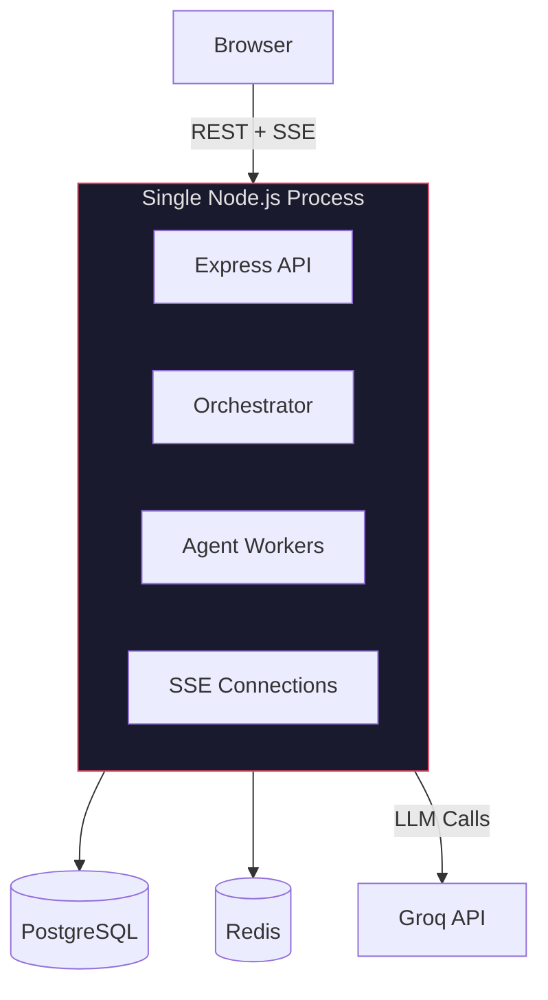
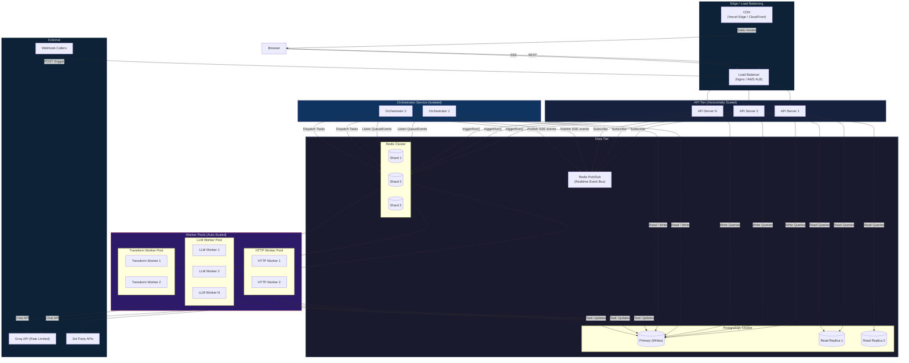
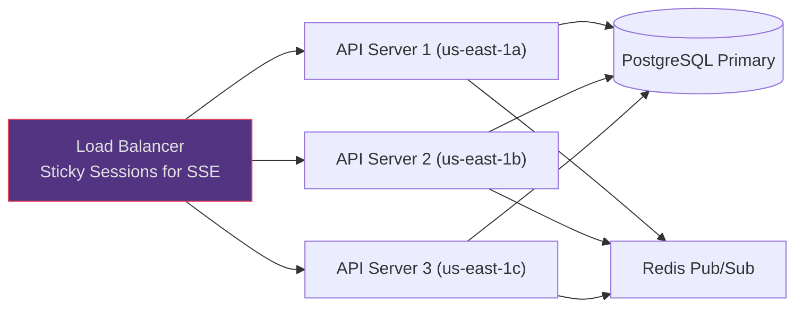
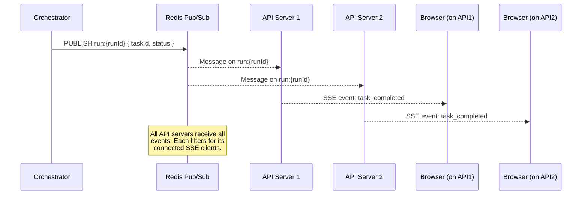
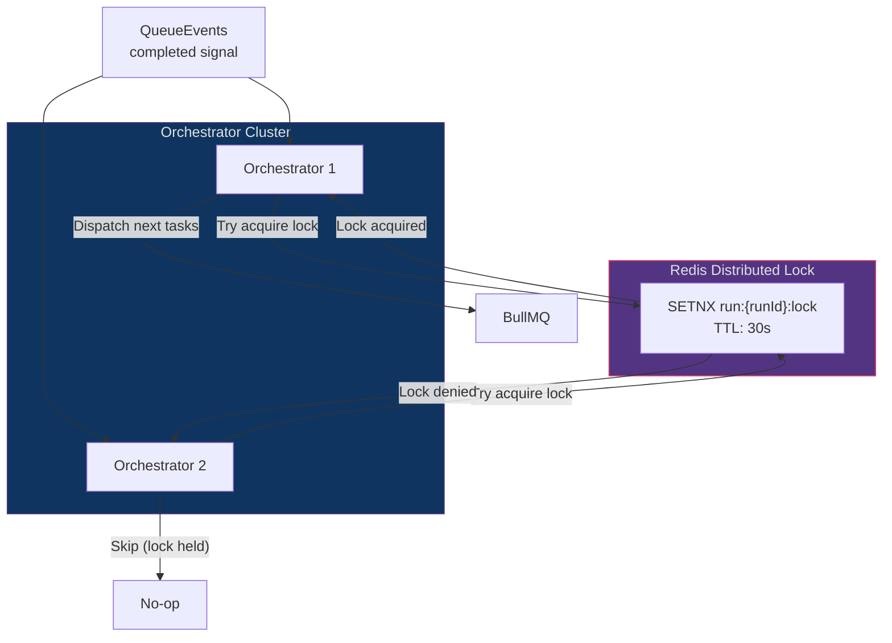
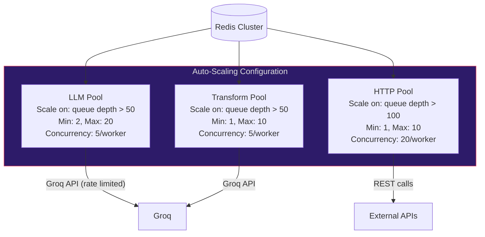
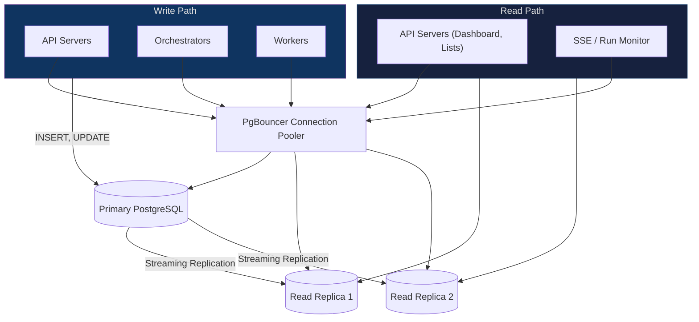
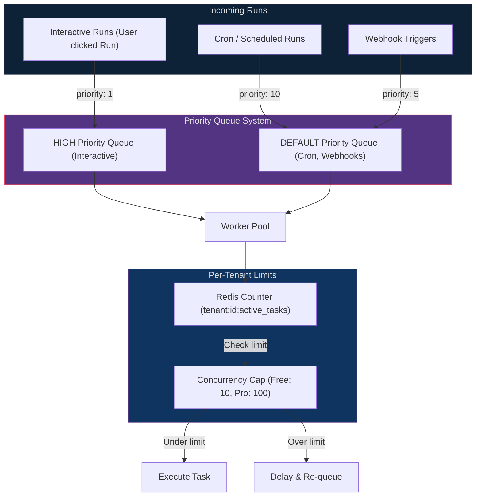
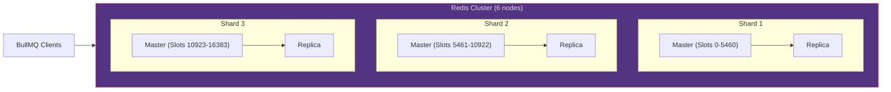
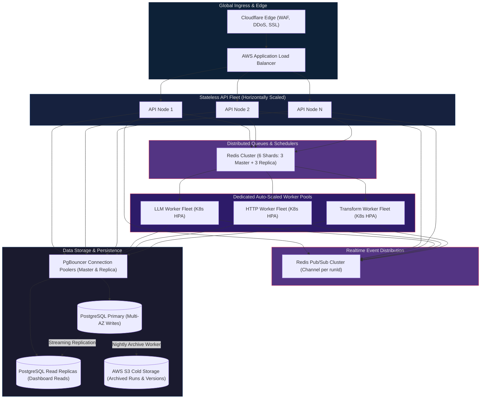

# Scaling Orqestr — System Design at Scale

This document explains how Orqestr's architecture would evolve to handle **10,000+ concurrent workflow runs**, **multi-region deployment**, and **enterprise-grade reliability**. Each section covers the current design, why it breaks at scale, and the production-grade solution.

---

## Current vs Scaled Architecture

### Current Architecture (Single-Process)

Everything runs in one Node.js process — the API server, orchestrator, agent workers, and SSE connections all share the same runtime. This is great for local development and small-to-medium workloads.



**What breaks at scale:**
- Single process = single point of failure
- SSE connections are stateful and pinned to one server
- Orchestrator is an in-memory EventEmitter, not visible to other processes
- No way to independently scale workers vs API servers
- One slow LLM call can starve the event loop for API responses

---

### Scaled Architecture (Distributed)



---

## Scaling Each Component

### 1. API Servers — Horizontal Scaling

**Problem**: A single Express server handles all REST + SSE connections. Under 10k concurrent runs, the event loop saturates.

**Solution**: Run N stateless API instances behind a load balancer.



**Key decisions:**
- **Sticky sessions** for SSE connections (ALB cookie affinity) so reconnects go to the same server
- API servers are stateless — any server can handle any REST request
- Health check endpoint (`GET /health`) enables auto-scaling groups to detect unhealthy instances

---

### 2. SSE — Cross-Instance Broadcasting with Redis Pub/Sub

**Problem**: `RunEmitter` is a Node.js `EventEmitter` singleton. It only exists in the process that runs the orchestrator. Other API server instances can't receive events.

**Solution**: Replace `EventEmitter` with Redis Pub/Sub. The orchestrator publishes to a Redis channel, all API servers subscribe and forward to their connected SSE clients.



**What changes in code:**
```
// Current (single-process)
runEmitter.emit(`run:${runId}`, event);

// Scaled (distributed)
redis.publish(`run:${runId}`, JSON.stringify(event));
```

---

### 3. Orchestrator — Isolated Service with Distributed Locking

**Problem**: The orchestrator currently runs inside the API server process. At scale, it needs to be a dedicated service that can run multiple instances without double-dispatching tasks.

**Solution**: Extract orchestrator into its own process. Use Redis distributed locks (`SETNX`) to ensure only one orchestrator instance processes a given run's completion event.



**Why not partition by runId instead?**
Partitioning (e.g., consistent hashing of runId to orchestrator instance) is more efficient but adds complexity around rebalancing when instances join or leave. Distributed locking is simpler and correct for this throughput range.

**Current Invariant Foundation (Implemented in Code):**
Even within the current architecture, critical distributed invariants are enforced at the database and queue layer:
- **Atomic Task Claiming**: Before queueing downstream tasks in multi-parent fan-in scenarios, `dispatchUnblockedTasks` uses `prisma.task.updateMany({ where: { id, status: PENDING }, data: { status: RUNNING } })`. Sibling parent completion loops that see `count === 0` exit immediately.
- **Queue-Level Deduplication**: BullMQ jobs are submitted with `{ jobId: task.id }`, ensuring Redis rejects duplicate job insertions.
- **Queue Insertion Compensation**: If BullMQ throws during insertion, task status reverts to `PENDING` to avoid permanently orphaned tasks.
- **Status Guards & Atomic Finalization**: `onTaskCompleted` respects terminal run states (`FAILED` / `CANCELLED`), and finalizes successful runs via atomic conditional update on `RUNNING` status.

---

### 4. Worker Pools — Independent Auto-Scaling

**Problem**: All agent workers run in the API server process. An LLM call that takes 5 seconds blocks nothing thanks to async, but 1000 concurrent LLM calls saturate the Groq rate limit and starve HTTP workers.

**Solution**: Run each agent type as a separate deployable pool with independent scaling policies.



**Key insight**: LLM workers are rate-limited by the provider (Groq). Scaling beyond the rate limit just wastes containers. Use BullMQ's `limiter: { max: 100, duration: 60000 }` to cap throughput per queue.

---

### 5. Database — Read Replicas & Connection Pooling

**Problem**: A single PostgreSQL instance handles all reads and writes. Dashboard queries (`COUNT`, `GROUP BY`) compete with task status updates.

**Solution**:



**Prisma configuration for read replicas:**
```prisma
datasource db {
  provider = "postgresql"
  url      = env("DATABASE_URL")          // Primary (writes)
  directUrl = env("DATABASE_DIRECT_URL")  // Direct connection (migrations)
}
```

---

### 6. Multi-Tenant Fairness — Noisy Neighbor Prevention

**Problem**: Tenant A schedules 5,000 workflows. Tenant B's single interactive run waits behind 5,000 jobs.

**Solution**: Tenant-aware queue management with priority lanes and concurrency caps.



---

### 7. Redis — Cluster Mode for Queue Scalability

**Problem**: Single Redis instance is a bottleneck and single point of failure.

**Solution**: Redis Cluster with multiple shards. BullMQ natively supports Redis Cluster — queues are distributed across shards by key hashing.



**Persistence**: Enable `RDB` snapshots + `AOF` (Append-Only File) to survive Redis restarts without losing queued jobs:
```conf
save 900 1
save 300 10
appendonly yes
appendfsync everysec
```

---

## Summary: Scaling Decision Matrix

| Component | Current Implementation | Proposed Scale-Out Architecture | Why & Trade-Off |
| :--- | :--- | :--- | :--- |
| **API Server** | 1 process | $N$ stateless instances + Load Balancer | Horizontal scaling, fault isolation; requires external session handling (already stateless JWT). |
| **Orchestrator** | In-process | Dedicated service + Redis locks | Prevents double-dispatch, independent scaling; adds Redis distributed locking overhead. |
| **Agent Workers** | In-process | Per-type auto-scaling pools | Rate limit isolation, independent scaling policies; more container processes to manage. |
| **SSE / Real-time** | EventEmitter singleton | Redis Pub/Sub fanout | Cross-instance event broadcasting; requires client REST initial sync due to lack of replay buffer. |
| **PostgreSQL** | Single instance | Primary + Read Replicas + PgBouncer | Separate read/write paths, connection pooling; read replica replication lag (< 100ms). |
| **Redis** | Single instance | Redis Cluster (3 shards + replicas) | High availability, horizontal throughput, persistence; requires Redis Cluster-aware client tooling. |
| **Scheduling** | BullMQ Repeatables | Same (distributed by design) | Already singleton-safe across replicas via Redis sorted sets. |
| **Multi-Tenancy** | Shared DB + organizationId | Same + priority queues + concurrency caps | Prevents noisy neighbors from exhausting queues. |

---

## Growth Scenarios: Deep System Evolution Analysis

The following sections analyze how the system accommodates scale across four distinct growth axes:

### Scenario A — More Users (1K → 10K → 100K → 1M Users)

When user counts scale from early adoption to enterprise levels, the pressure falls primarily on the **Edge Ingress**, **Authentication**, and **Read-Heavy Query Paths**:

1. **Stateless API Tier & Load Balancing**:
   - At 1K users, a single Node.js process easily handles inbound traffic.
   - At 100K+ users, deploy a stateless cluster of Express containers behind an Application Load Balancer (AWS ALB / Cloudflare).
   - Traffic distribution uses round-robin for REST APIs and IP/cookie hash sticky sessions for long-lived SSE connections.
2. **Authentication & Session Scalability**:
   - Because access tokens are **stateless JWTs (15-minute TTL)**, API servers verify them locally using public/private key pairs or HMAC secrets with **zero database queries per authenticated request**.
   - Database lookups occur only during token refresh (once every 15 minutes per active client) and login/logout.
   - At 1M users, refresh token lookups in PostgreSQL are accelerated by the `refresh_tokens(token)` unique index and `refresh_tokens(expiresAt)` cleanup index. An automated nightly cron purges expired tokens to maintain small table size.
3. **Database Connection Pooling**:
   - 1M users generating concurrent requests would quickly exhaust PostgreSQL's `max_connections` limit (typically 100–300).
   - Deploy **PgBouncer** in transaction pooling mode. PgBouncer multiplexes 10,000+ client connections down to ~50 persistent backend database connections.
4. **Cache-Aside Read Protection**:
   - Users repeatedly poll dashboard metrics and workflow lists.
   - `CacheService` caches aggregated dashboard stats and workflow definitions in Redis with targeted 60s–300s TTLs, reducing database load by over 85%.

---

### Scenario B — More Workflows (1K → 50K → 1M Workflow Definitions)

Scaling the volume of stored workflow blueprints impacts database storage, query indexing, and version history:

1. **PostgreSQL Indexing & Query Patterns**:
   - Workflows are partitioned logically by tenancy using composite indexes:
     - `@@index([organizationId])`: Fast filtering for organization workspaces.
     - `@@index([userId])`: Fast filtering for personal workspaces.
     - `@@index([isArchived])`: Excludes soft-deleted workflows from active dashboard listings without table scans.
2. **Visual Graph Storage (`JSONB`)**:
   - Each workflow definition stores React Flow nodes and edges as `JSONB`. Average graph size is 10 KB–50 KB.
   - 1M workflows require approximately 30 GB–50 GB of storage, which easily fits within standard SSD volumes.
   - PostgreSQL's TOAST (The Oversized-Attribute Storage Technique) transparently compresses JSONB payloads > 2 KB out-of-line.
3. **Historical Version Pruning & Cold Archival**:
   - Every `PUT /api/workflow/:id` creates an immutable `WorkflowVersion` row.
   - If workflows update frequently, version tables can balloon to tens of millions of rows.
   - **Scale Strategy**: Implement an automated archival policy. Active versions (last 10 versions) remain in PostgreSQL. Older versions (> 90 days) are archived into cold S3 object storage as compressed JSON files, referenced by an S3 URI.

---

### Scenario C — More Workflow Executions (100 → 1,000 → 10,000 → 100,000 Runs/Min)

This is the most critical scaling axis. High execution throughput strains the task queue, worker concurrency, and database write throughput:

1. **BullMQ Queue Sharding & Redis Memory Management**:
   - Ingesting 100,000 runs/minute with 5 tasks per run generates **500,000 tasks/minute (~8,333 tasks/sec)**.
   - A single Redis instance caps around 25,000 operations/sec. 8,333 tasks/sec (with push, pop, lock renewal, and completion events) exceeds single-thread Redis limits.
   - **Scale Strategy**: Deploy **Redis Cluster** with slot hash-tagging. Partition queues by agent type (`{llm}:queue`, `{http}:queue`, `{transform}:queue`) so that jobs are evenly distributed across independent Redis shards.
2. **Dedicated, Auto-Scaled Worker Fleets**:
   - Separate worker pools prevent slow LLM tasks from starving fast HTTP or Transform tasks.
   - **LLM Fleet**: Concurrency tuned to provider rate limits (e.g. Groq TPM/RPM). Auto-scales on queue latency.
   - **HTTP Fleet**: High concurrency (20–50 concurrent requests per worker container) because I/O wait times are low.
   - **Transform Fleet**: In-memory JSON manipulation workers scaling on CPU utilization.
3. **Queue Backpressure & Concurrency Throttling**:
   - Use BullMQ's built-in queue rate limiters: `limiter: { max: 500, duration: 60000 }` to avoid overwhelming external LLM APIs with HTTP 429 errors.
   - Jobs exceeding the threshold remain in BullMQ's `delayed` sorted set and are pulled as capacity clears.
4. **Idempotency & Deduplication at Scale**:
   - Downstream tasks are pushed with `{ jobId: task.id }` ensuring Redis rejects accidental duplicate job submissions.
   - Terminal status guards and atomic database claiming (`updateMany`) guarantee that even under extreme concurrency, tasks execute at-least-once with idempotent database state transitions.

---

### Scenario D — Global Enterprise Tier (Concurrent Users + High Executions)

When both high user traffic and massive execution volume occur simultaneously:



---

## Capacity Reasoning & Illustrative Calculations

*(The calculations below represent illustrative capacity planning assumptions designed for system-design interview discussions, not empirical benchmark measurements)*

### 1. Throughput & Load Assumptions
* **Active User Base**: 100,000 registered users; 2,000 peak concurrent active sessions.
* **Workflow Workload**:
  - 200 concurrent workflow runs in progress at any given second.
  - Average workflow structure: 5 nodes (1 HTTP fetch, 2 parallel LLM analyses, 1 transform, 1 notification).
  - Average run duration: 3 seconds.

### 2. Derived System Demands
* **Run Trigger Rate**:
  $$\text{Runs/sec} = \frac{200 \text{ concurrent runs}}{3 \text{ seconds}} \approx 67 \text{ runs/sec}$$
* **Task Throughput**:
  $$\text{Tasks/sec} = 67 \text{ runs/sec} \times 5 \text{ tasks/run} = 335 \text{ tasks/sec}$$
* **Redis Operations/Sec**:
  - Each task generates: 1 queue push + 1 worker pop + 2 lock heartbeats + 1 completion ack = 5 ops.
  - Plus 67 run status events published over Pub/Sub.
  $$\text{Redis Ops/sec} = (335 \times 5) + 67 \approx 1,742 \text{ ops/sec}$$
  *(A single Redis instance easily handles 25,000–50,000 ops/sec; this consumes < 7% of a single node's capacity).*
* **PostgreSQL Write Throughput**:
  - Run record: 1 insert (start) + 1 update (finish) = 134 writes/sec.
  - Task records: 5 inserts (start) + 5 updates (finish) $\times 67 = 670$ writes/sec.
  $$\text{Total DB Writes/sec} \approx 804 \text{ writes/sec}$$
  *(Standard PostgreSQL on an AWS RDS `db.r6g.xlarge` instance supports 3,000–5,000 writes/sec with PgBouncer).*
* **SSE Concurrent Connections**:
  - 2,000 concurrent active users watching live runs = 2,000 open HTTP sockets.
  - Event loop overhead: Each open socket consumes ~10 KB of memory in Node.js. 2,000 sockets $\approx 20\text{ MB}$, well within standard container memory limits (512 MB–1 GB).

---

## Bottleneck Evolution: What Fails First?

In a system design interview, identifying **which component bottlenecks first and why** demonstrates senior architectural judgment:

```
┌───────────────────────────────────────────────────────────────────────────────────────────────────┐
│                                 BOTTLENECK BOTTLENECK PRIORITY HIERARCHY                          │
├─────┬──────────────────────────┬─────────────────────────────┬────────────────────────────────────┤
│ Tier│ Component                │ Breaking Point              │ Root Cause & Mitigation            │
├─────┼──────────────────────────┼─────────────────────────────┼────────────────────────────────────┤
│ 1st │ External LLM Provider    │ ~50–100 req/sec             │ Rate limits (Groq TPM/RPM caps).   │
│     │ (Groq / OpenAI)          │                             │ Mitigate with queue rate-limiters  │
│     │                          │                             │ and multi-provider fallback.       │
├─────┼──────────────────────────┼─────────────────────────────┼────────────────────────────────────┤
│ 2nd │ PostgreSQL Connections   │ ~100–300 connections        │ Direct worker connections exhaust  │
│     │                          │                             │ pool. Mitigate with PgBouncer.     │
├─────┼──────────────────────────┼─────────────────────────────┼────────────────────────────────────┤
│ 3rd │ In-Memory SSE Broadcast  │ Multi-server deployment     │ Node EventEmitter is single-host.  │
│     │                          │                             │ Mitigate with Redis Pub/Sub.       │
├─────┼──────────────────────────┼─────────────────────────────┼────────────────────────────────────┤
│ 4th │ Single Redis Memory/CPU  │ ~25,000 ops/sec             │ Redis queue and sorted set I/O.    │
│     │                          │                             │ Mitigate with Redis Cluster.       │
├─────┼──────────────────────────┼─────────────────────────────┼────────────────────────────────────┤
│ 5th │ Node.js Event Loop       │ ~1,000 req/sec per node     │ Heavy JSON stringification.        │
│     │                          │                             │ Mitigate with ALB + auto-scaling.  │
└─────┴──────────────────────────┴─────────────────────────────┴────────────────────────────────────┘
```
