# End-to-End User Flows

Complete walkthrough of every user journey in Orqestr — from first visit to watching execution results stream in real time. Covers all edge cases, error paths, and how the system handles each one.

---

## Table of Contents

- [1. Authentication Flow](#1-authentication-flow)
- [2. Building & Saving a Workflow (Unauthenticated → Authenticated)](#2-building--saving-a-workflow-unauthenticated--authenticated)
- [3. Workflow Execution Flow](#3-workflow-execution-flow)
- [4. Task Failure & Retry Handling](#4-task-failure--retry-handling)
- [5. Real-Time Monitoring via SSE](#5-real-time-monitoring-via-sse)
- [6. Multiple Run Clicks & Concurrent Runs](#6-multiple-run-clicks--concurrent-runs)
- [7. Token Expiration Mid-Session](#7-token-expiration-mid-session)
- [8. Workflow Triggered via Webhook or Cron](#8-workflow-triggered-via-webhook-or-cron)
- [9. Stale Run Cleanup](#9-stale-run-cleanup)
- [10. Workspace & Organization Management, Invitations & RBAC](#10-workspace--organization-management-invitations--rbac)
- [11. OAuth Flow with Cryptographic State & One-Time Exchange](#11-oauth-flow-with-cryptographic-state--one-time-exchange)
- [12. Advanced Workflow Builder: Node Testing, DAG Validation, Auto-Layout & Versioning](#12-advanced-workflow-builder-node-testing-dag-validation-auto-layout--versioning)
- [13. Run Cancellation Flow](#13-run-cancellation-flow)
- [14. Workflow Soft-Delete Archival & Scheduler Cleanup](#14-workflow-soft-delete-archival--scheduler-cleanup)

---

## 1. Authentication Flow

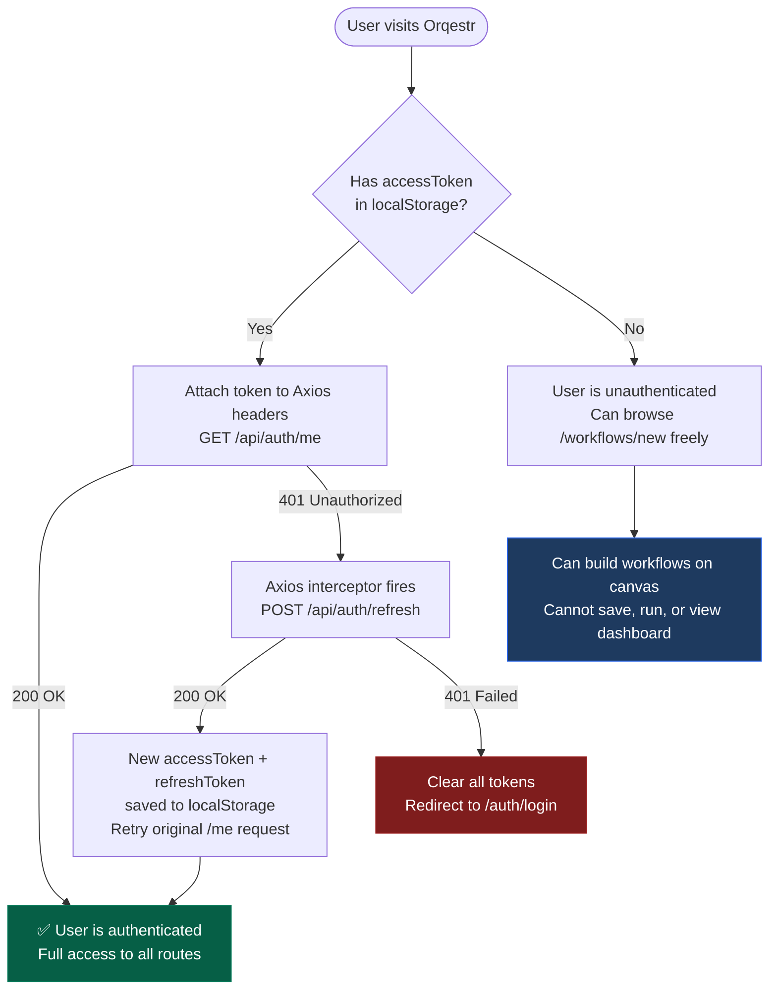

### Route Protection

Every API route except these public endpoints requires the `authenticate` middleware (JWT Bearer token):

| Route | Auth Required? | Why |
|-------|---------------|-----|
| `POST /api/auth/register` | ❌ No | Creating an account (rate-limited) |
| `POST /api/auth/login` | ❌ No | Logging in (rate-limited) |
| `POST /api/auth/refresh` | ❌ No | Refreshing expired tokens (rate-limited) |
| `POST /api/auth/logout` | ❌ No | Invalidate refresh token from cookie or body |
| `GET /api/auth/google` | ❌ No | Initiates Google OAuth with cryptographic state |
| `GET /api/auth/google/callback` | ❌ No | Consumes state, issues one-time exchange code |
| `GET /api/auth/github` | ❌ No | Initiates GitHub OAuth with cryptographic state |
| `GET /api/auth/github/callback` | ❌ No | Consumes state, issues one-time exchange code |
| `POST /api/auth/oauth/exchange` | ❌ No | Single-use ephemeral code exchange for session tokens (rate-limited) |
| `POST /api/webhooks/trigger/:token` | ❌ No | External webhook trigger (token-protected, rate-limited) |
| `GET /api/runs/:runId/stream` | ✅ Yes | SSE stream (authenticated via JWT query token/Bearer header & authorized by run ownership or org membership) |
| `POST /api/runs/:id/cancel` | ✅ Yes | Interactive run cancellation |
| `POST /api/agents/test` | ✅ Yes | Direct agent node execution testing (rate-limited at 20 req/min, SSRF guarded) |
| **Everything else** (`/api/workflow/*`, `/api/runs`, `/api/dashboard`, `/api/agents`, `/api/organizations`, `/api/notifications`) | ✅ Yes | Protected by `authenticate` middleware |

### Registration

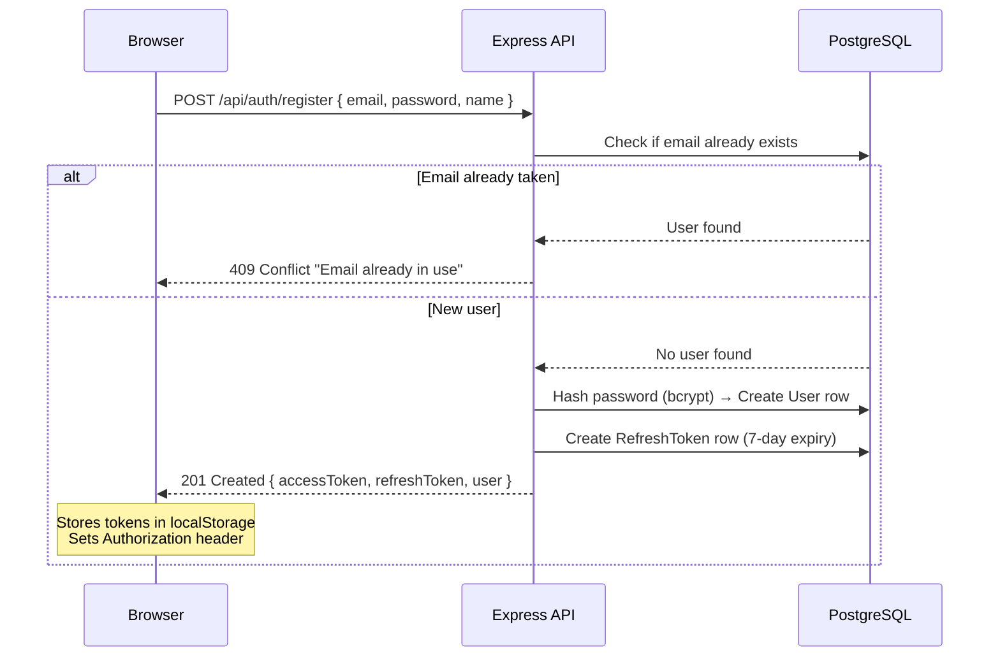

### Login

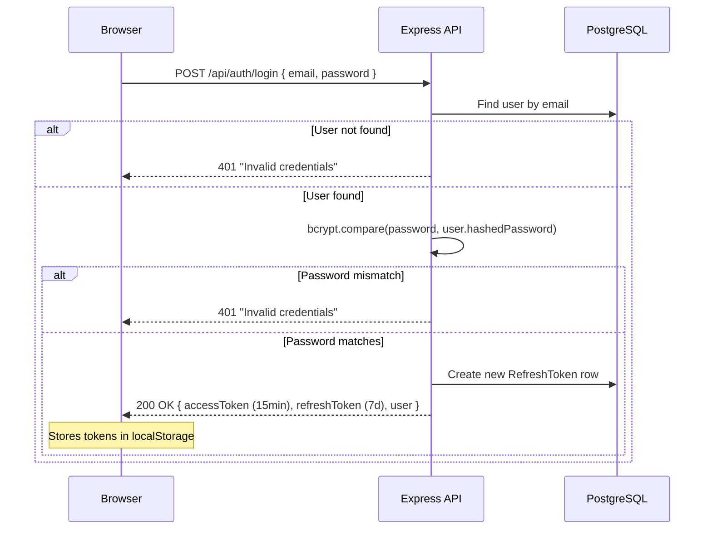

---

## 2. Building & Saving a Workflow (Unauthenticated → Authenticated)

This is the most interesting flow — a user can start building without being logged in, and the system ensures they never lose their work.

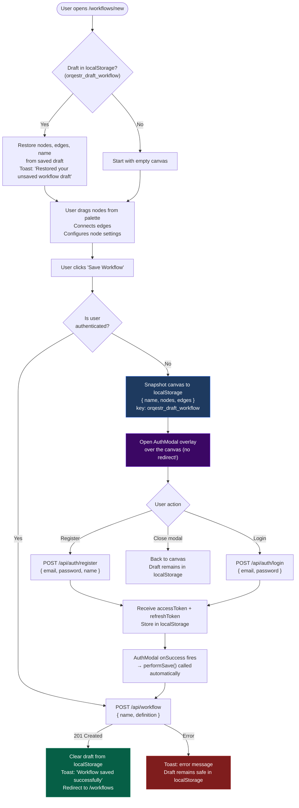

### Why this matters

Most apps redirect you to `/login` when you click save — your entire canvas state is gone. Orqestr:

1. **Saves the draft to localStorage** before showing the auth modal
2. **Shows the auth modal as an overlay** on top of the canvas (no page navigation)
3. **Automatically calls performSave()** after successful login/register
4. **Clears the draft** only after the API confirms the save succeeded
5. **Recovers the draft on reload** — if the user refreshes or navigates away, the canvas restores from localStorage on next visit

### What happens if the browser crashes after draft save?

The draft persists in `localStorage`. On next visit to `/workflows/new`, the `useEffect` hook reads `orqestr_draft_workflow`, restores the nodes/edges/name, and shows a toast notification.

---

## 3. Workflow Execution Flow

When a user clicks **"Trigger Run"** on a saved workflow:

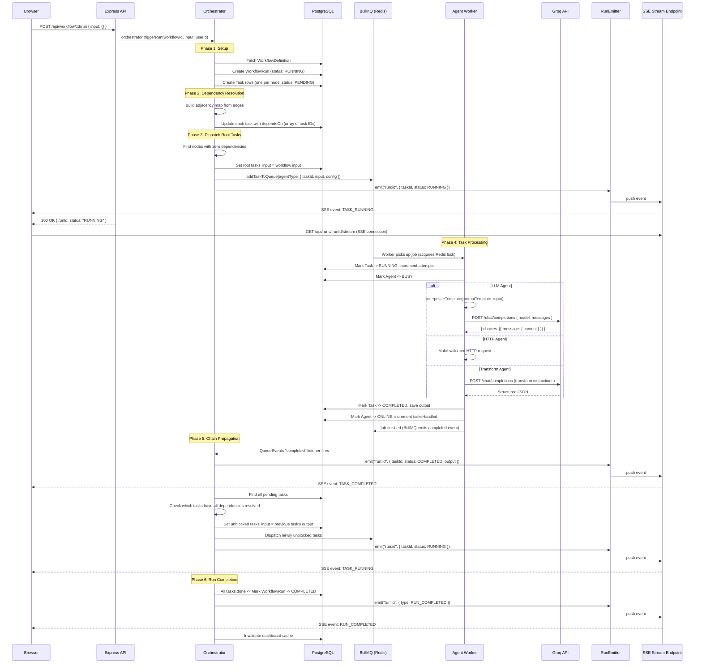

### How data flows between nodes

When Task A completes with an output like `{ data: { body: "Hello", user: { name: "Alice" } } }`, the orchestrator takes this entire output and sets it as the **input** for the next downstream task (Task B).

Inside Task B's agent, the template engine resolves any `{{placeholders}}` in the prompt against this input:

| Placeholder | Resolves to |
|-------------|------------|
| `{{body}}` | `"Hello"` (auto-unwraps `data.body`) |
| `{{user.name}}` | `"Alice"` (deep dot-notation traversal) |
| `{{data.body}}` | `"Hello"` (explicit path) |
| `{{input}}` | Full JSON stringified payload |

---

## 4. Task Failure & Retry Handling

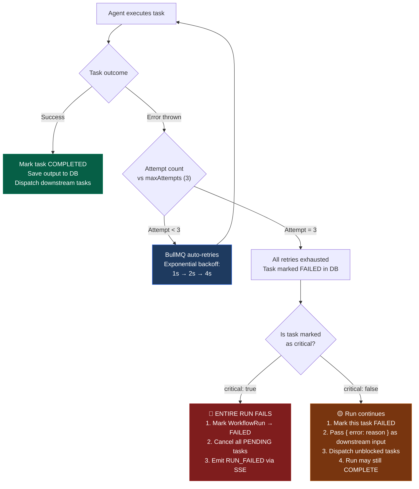

### What happens at each retry attempt

| Attempt | Backoff Delay | What happens |
|---------|--------------|-------------|
| 1st try | — | Agent calls `execute()`. On error: task stays FAILED in DB, error re-thrown to BullMQ |
| 2nd try | 1 second | BullMQ moves job to delayed set, waits 1s, re-queues. Agent re-processes. `attempts` incremented to 2. |
| 3rd try | 2 seconds | Same as above. `attempts` incremented to 3. |
| Final failure | — | BullMQ moves job to failed set. Orchestrator's `QueueEvents.on("failed")` fires. Critical check runs. |

### Critical vs Non-Critical — real example

Consider a 3-node pipeline: `HTTP Agent → LLM Agent → Transform Agent`

**If LLM Agent is critical (default) and fails all 3 retries:**
- LLM Agent task → `FAILED`
- Transform Agent task → `CANCELLED` (was still `PENDING`)
- WorkflowRun → `FAILED`
- SSE emits `RUN_FAILED`

**If LLM Agent is non-critical and fails all 3 retries:**
- LLM Agent task → `FAILED`
- Transform Agent receives `{ error: "Groq API returned 429 rate limit" }` as its input
- Transform Agent still runs and tries to work with whatever it got
- WorkflowRun → `COMPLETED` (with partial failure)

---

## 5. Real-Time Monitoring via SSE

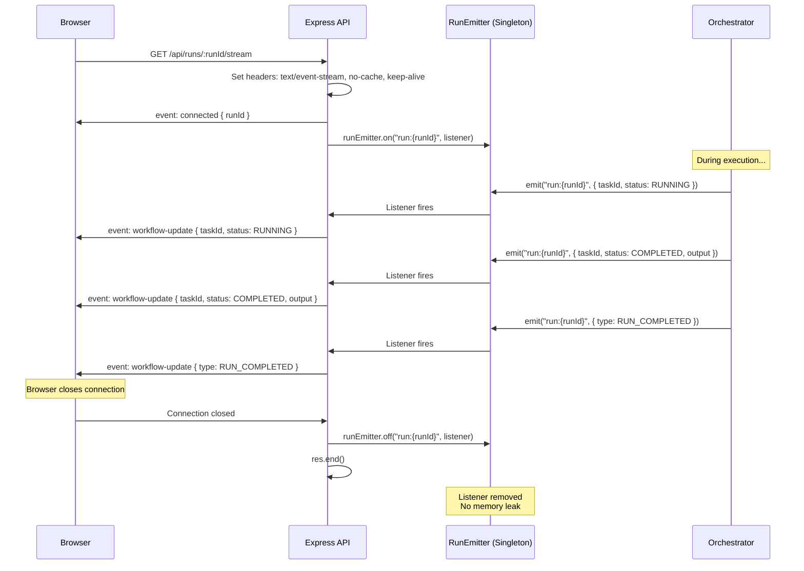

### What if the browser disconnects mid-run?

The SSE connection is cleaned up (`req.on("close")` removes the event listener), but the **run continues executing on the backend**. The run is completely independent of the SSE connection. The user can reconnect by opening the Run Monitor page again — it will fetch the current state from the database and re-establish the SSE stream.

---

## 6. Multiple Run Clicks & Concurrent Runs

### What happens if the user clicks "Trigger Run" 5 times rapidly?

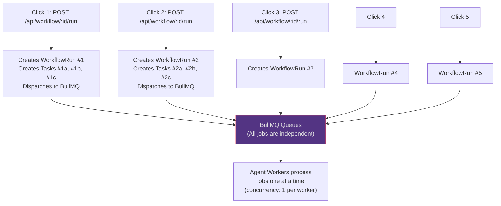

**Each click creates a completely independent run.** There is no deduplication or click throttling at the API level. Each run gets:

- Its own `WorkflowRun` row with a unique `runId`
- Its own set of `Task` rows (one per node)
- Its own BullMQ jobs in the queue

The runs execute **concurrently** — all their root tasks enter the queues and workers process them in order. Since each worker has `concurrency: 1`, BullMQ processes one job at a time per worker, but multiple workers across different agent types process in parallel.

**If you want to prevent this:** The frontend can disable the "Run" button while `isPending` is true (the mutation hook's loading state), but the backend does not block multiple runs — this is by design, since batch runs and stress testing require it.

---

## 7. Token Expiration Mid-Session

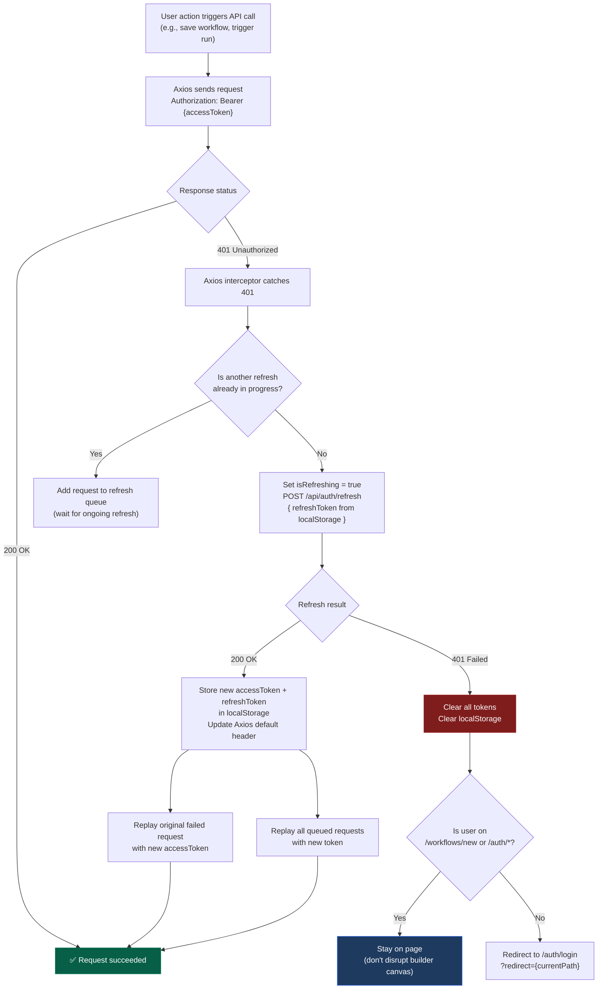

### Why the builder page doesn't redirect

The Axios interceptor explicitly checks: if the current page is `/workflows/new` or any `/auth/*` page, it does **not** redirect to login. This prevents the builder from losing canvas state. Instead, the user stays on the page, and if they try to save, the AuthModal appears.

### What if 5 API calls fail simultaneously with 401?

Only the **first** failing call triggers the refresh. The other 4 are added to a `refreshQueue` array. Once the refresh completes, all 5 queued requests are replayed with the new token. This prevents 5 simultaneous refresh requests hitting the server.

---

## 8. Workflow Triggered via Webhook or Cron

### Webhook Trigger (External Service)

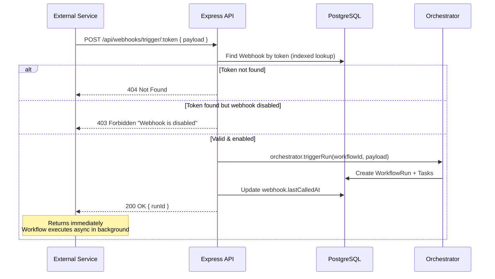

**No JWT required.** The webhook uses its own high-entropy secret token (48-char hex) for authentication, completely separate from user JWTs.

### Cron Scheduled Run

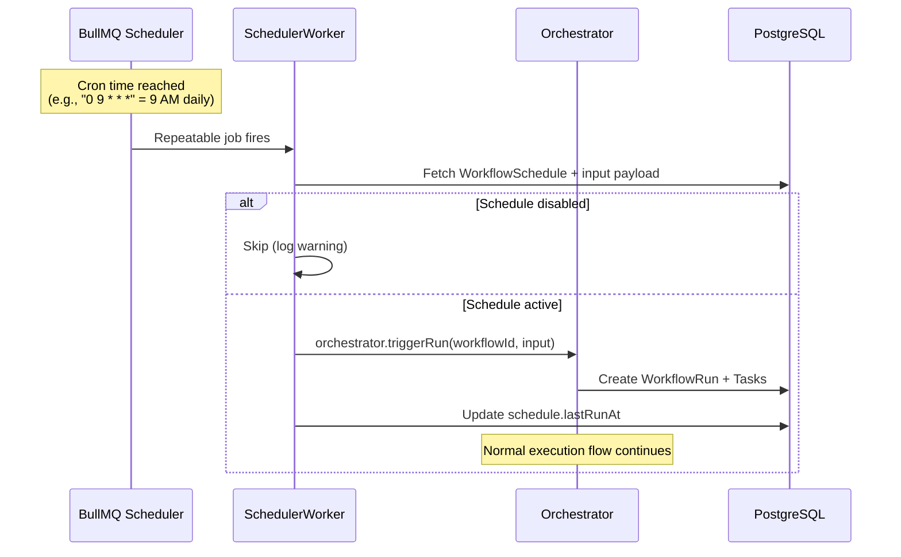

---

## 9. Stale Run Cleanup

Runs can get stuck in `RUNNING` status if a worker crashes, Redis loses a job, or a network partition occurs. The orchestrator runs a background cleanup every 5 minutes:

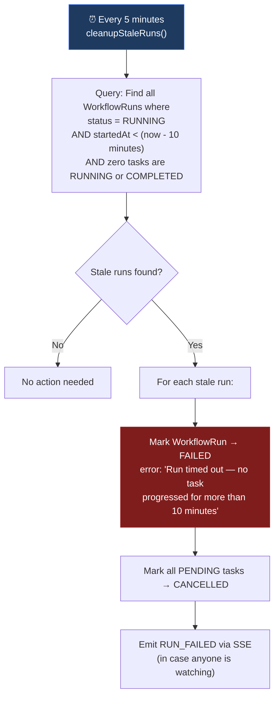

**Why the condition checks for zero RUNNING/COMPLETED tasks:**
If at least one task is actively running or has completed, the run is making progress — it's not stale. The cleanup only catches runs where literally nothing happened for 10 minutes (e.g., all tasks are still `PENDING` and no worker ever picked them up).

---

## Complete User Journey Summary

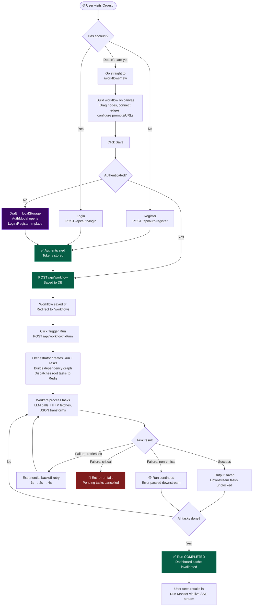

---

## 10. Workspace & Organization Management, Invitations & RBAC

Orqestr supports multi-tenant collaborative workspaces with strict role-based access control (`OWNER`, `ADMIN`, `MEMBER`).

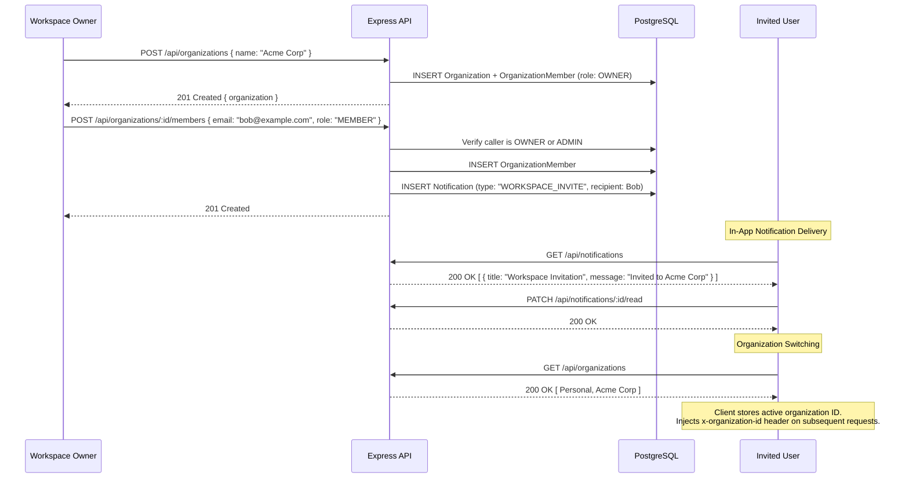

### RBAC Permissions Matrix

| Action | `OWNER` | `ADMIN` | `MEMBER` |
| :--- | :---: | :---: | :---: |
| **View Workflows & Runs** | ✅ Yes | ✅ Yes | ✅ Yes |
| **Create & Edit Workflows** | ✅ Yes | ✅ Yes | ✅ Yes |
| **Trigger Runs & Test Nodes** | ✅ Yes | ✅ Yes | ✅ Yes |
| **Manage Schedules & Webhooks** | ✅ Yes | ✅ Yes | ✅ Yes |
| **Invite Members** | ✅ Yes | ✅ Yes | ❌ No (403) |
| **Change Member Roles** | ✅ Yes | ❌ No (403) | ❌ No (403) |
| **Remove Members** | ✅ Yes | ✅ Yes (non-owners) | ❌ Only Self (Leave) |
| **Delete Workflow** | ✅ Yes | ✅ Yes | ❌ No (403 Forbidden) |
| **Delete Organization** | ✅ Yes | ❌ No (403) | ❌ No (403) |

---

## 11. OAuth Flow with Cryptographic State & One-Time Exchange

To prevent CSRF state attacks and eliminate token leakage in browser history or referer headers, Orqestr uses a cryptographic state parameter and an ephemeral single-use exchange code:

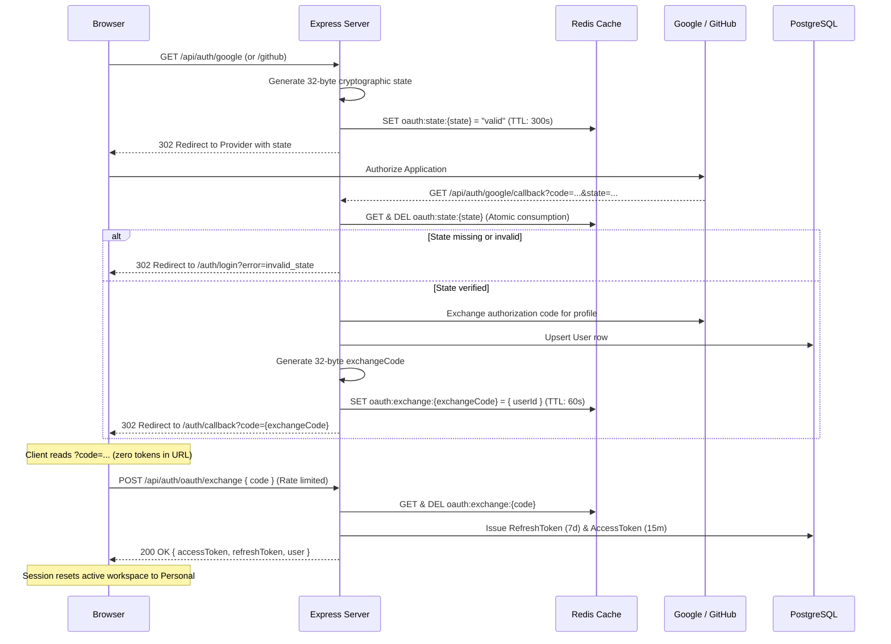

---

## 12. Advanced Workflow Builder: Node Testing, DAG Validation, Auto-Layout & Versioning

The visual workflow composition canvas integrates developer safeguards and utilities:

1. **Direct Node Testing (`POST /api/agents/test`)**:
   - Allows users to test any individual agent node (LLM inference, HTTP request, or data transformation) with mock input before saving the workflow.
   - Protected by authentication, Redis rate limiting (20 req/min), SSRF validation, and a 5MB response size limit.
2. **DAG Validation & Topological Integrity**:
   - Kahn's algorithm validates that the graph has at least one node and is completely free of cycles or self-referencing loops prior to saving or triggering.
3. **Auto-Layout (Dagre Algorithm)**:
   - One-click topological auto-layout organizes chaotic canvas nodes into clean left-to-right or top-to-bottom execution hierarchies.
4. **Undo / Redo & JSON Import / Export**:
   - History stack enables multi-level undo/redo operations on canvas state.
   - Workflows can be exported to portable JSON definitions and imported across workspaces.
5. **Workflow Version Snapshots & One-Click Restore**:
   - Every `PUT /api/workflow/:id` creates an immutable `WorkflowVersion` record.
   - Users can inspect historical versions and rollback via `POST /api/workflow/:id/versions/:version/restore`.
6. **Workflow Duplication**:
   - `POST /api/workflow/:id/duplicate` clones graph definitions into new independent blueprints.

---

## 13. Run Cancellation Flow

Users can abort long-running or runaway workflow executions directly from the UI or API:

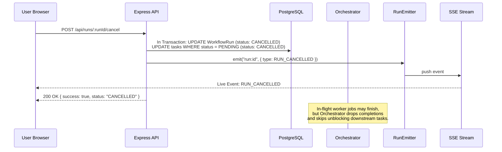

---

## 14. Workflow Soft-Delete Archival & Scheduler Cleanup

When a user deletes a workflow, the system guarantees audit record preservation while cleaning up all active background jobs:

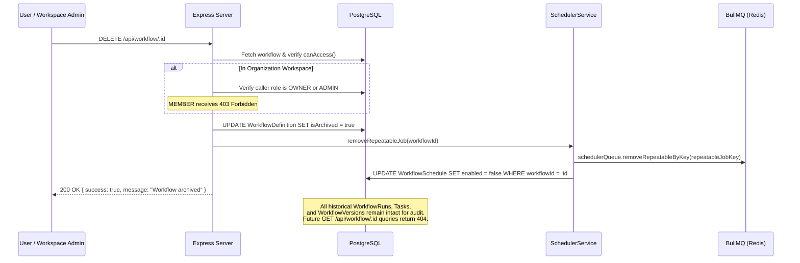

### Deletion Invariants:
1. **RBAC Guard**: In organization workspaces, only `OWNER` or `ADMIN` members can delete workflows (`MEMBER` receives `403 Forbidden`).
2. **Audit Preservation**: Hard deletes would cascade and delete historical runs and tasks. Soft-delete (`isArchived = true`) keeps the historical audit trail intact while removing the workflow from active listings.
3. **Automated Scheduler Purging**: The associated repeatable BullMQ cron job is immediately unregistered from Redis to prevent phantom executions of deleted workflows.
4. **Execution Prohibition**: Any attempt to trigger an archived workflow via REST (`POST /api/workflow/:id/run`) or webhook returns 404 `NotFoundError("Workflow", id)`.

